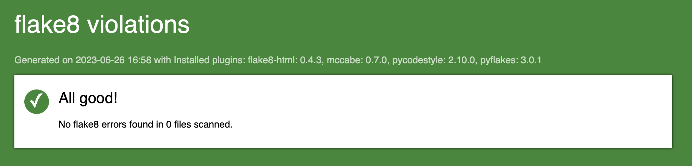
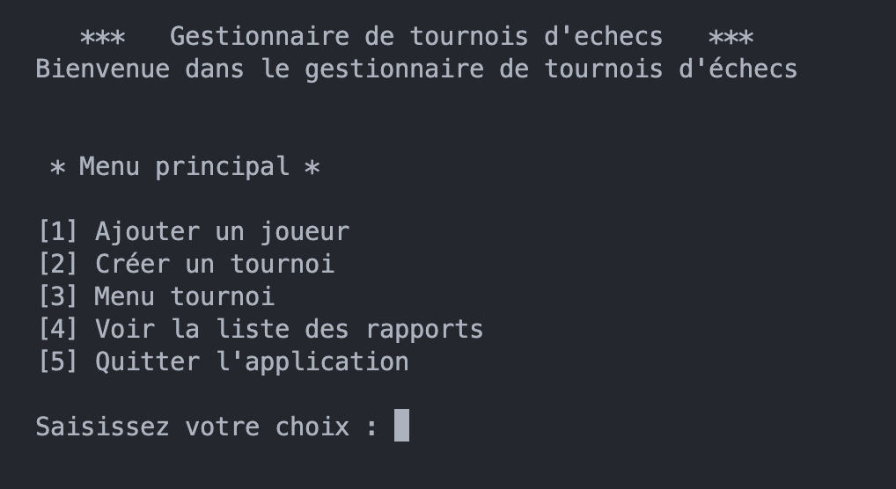
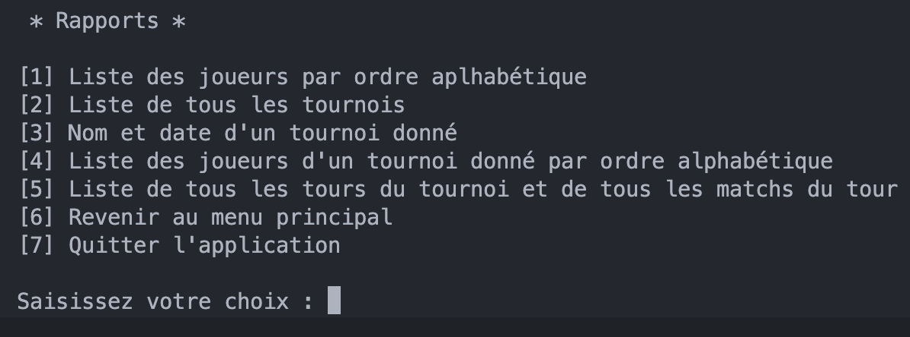
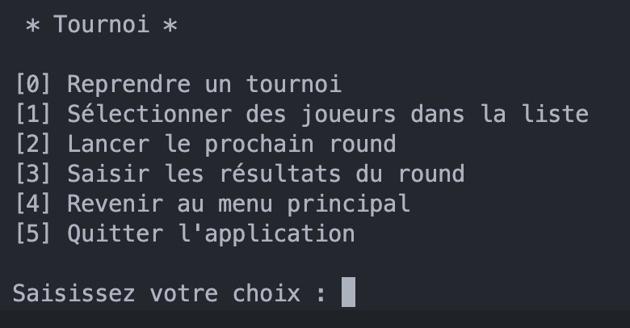
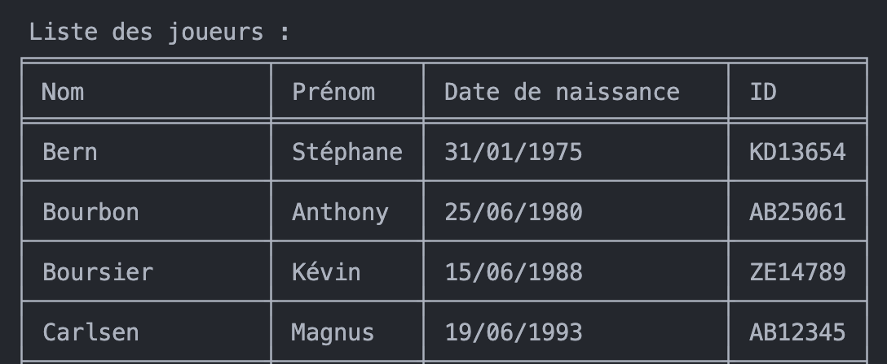
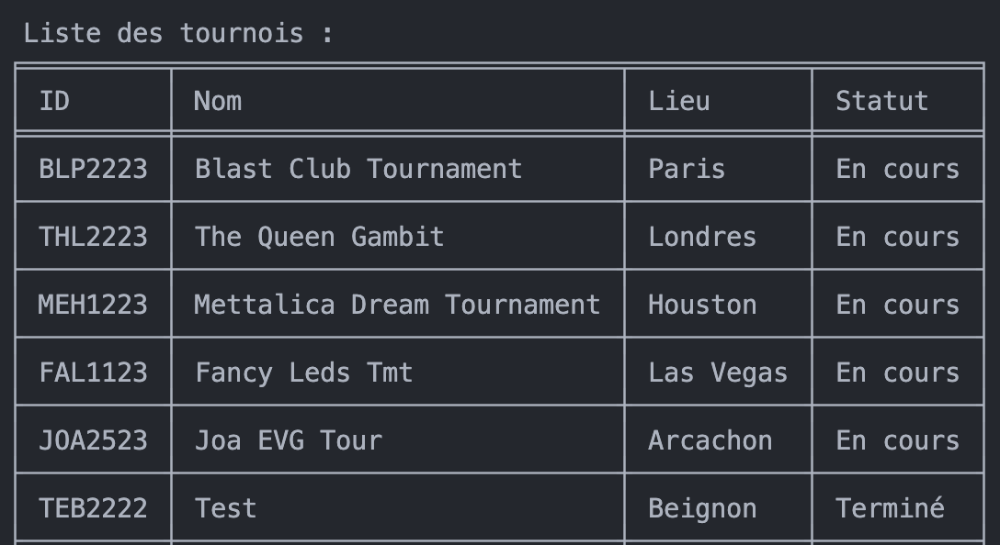
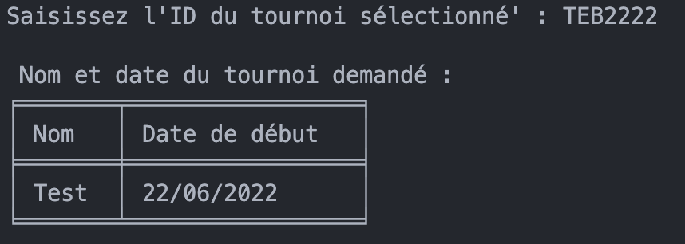
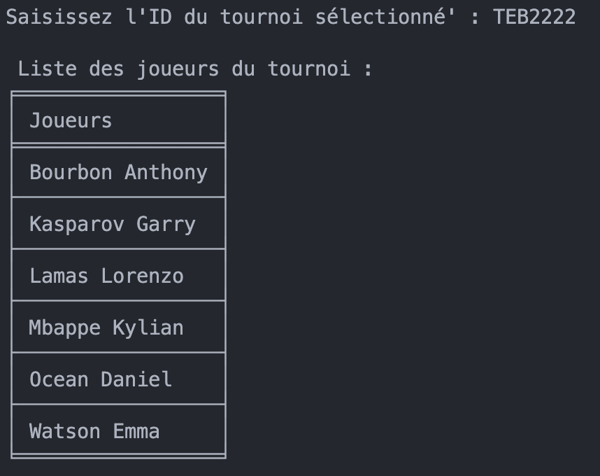
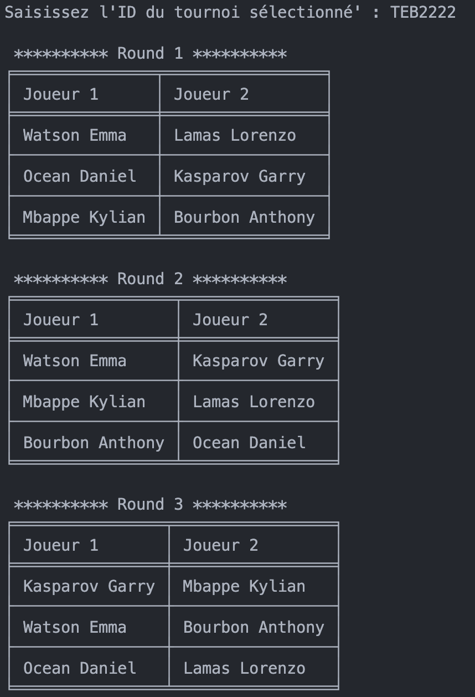
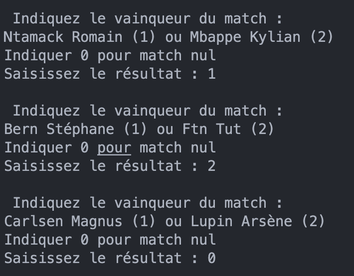

# Gestionnaire de tournoi d'échecs

**Ce logiciel permet de gérer l'organosation, la création et le suivi de tournois d'échecs, hors ligne.**

##  Pré-requis
+ Python 3.x
+ Modules recensés dans le fichier requirements.txt

## Création de votre environnement virtuel

Nous vous conseillons de créer un environnement virtuel afin d'y installer les dépendances nécessaires et exécuter votre code. 
Pour créer un environnement virtuel (nommé venv par convention), vous pouvez utiliser la commande : `python3 -m venv .venv`.

Pensez bien à activer vote environnement virtuel avec la commande : `. .venv/bin/activate`

## Installation

1. Cloner le projet sur votre ordinateur : `git clone https://github.com/Synaptee/OC_P4.git`
2. Installer les dépendances en utilisant pip : `pip install -r requirements.txt`

## Création d'un rapport Flake8

Pour générer un nouveau rapport, utilisez la commande `flake8 --format=html --htmldir=flake8_rapport flake8_rapport/`   

## Utilisation

Lancez le programme en utilisant la commande `python main.py`.

## Menus principaux

1. **Menu principal**

    1. Pour ajouter un joueur, il vous sera demandé de fournir :
        * Nom
        * Prénom
        * Date de naissance
        * ID national d'échec
    
    2. Pour créer un tournoi, il vous sera demandé de fournir :
        * Nom
        * Lieu
        * Date de début
        * Date de fin
        * Nombre de tours (4 par défauts)
        * Description

2. **Menu rapports**

3. **Menu tournoi**

## Exemples de rapports

+ **Liste des joueurs par ordre alphabétique**

+ **Liste de tous les tournois (dans la base de données)**

+ **Nom et date d'un tournoi donné**

+ **Liste des joueurs d'un tournoi donné**

+ **Liste de tous les tours et de tous les latchs du tour, d'un tournoi donné**

## Exemples de gestion d'un tournoi
+ **Sélectionner des joueurs à ajouter**

+ **Lancer le prochain round**

    Il vous sera demandé l'ID du tournoi. 

    * Si le round suivant est le premier round, alors les paires de joueurs sont créées aléatoirement.

    * Si le round suivant n'est pas le premier round, les paires de joueurs sont organisées en fonction du classement des joueurs.

    Deux joueurs ne doivent normalement pas s'affronter 2 fois au cours d'un même tournoi. 

+ **Saisir les résultats d'un round**

    Il vous sera demandé l'ID du tournoi, puis il vous faudra désigner le vainqueur de chaque match du round en cours. 

    * Saisir **1** si le joueur **(1)** a gagné
    * Saisir **2** si le joueur **(2)** a gagné
    * Saisir **0** si c'est un **match nul**
    

